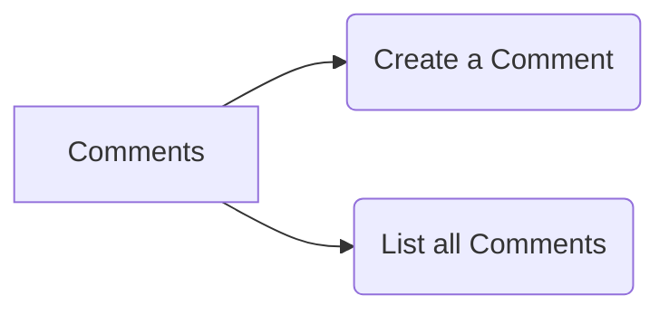

## Workflow for the comment service

The comment service has two functionality, `create comment` and `list of comments`

<br/>

<!--MERMAID {width:100}-->

<!--MCONTENT {content: "graph LR<br/>\nA\\[Comments\\] \\-\\-\\> B(Create a Comment)<br/>\nA \\-\\-\\> C(List all Comments)"} --->

<br/>

## **Goals**

1.  Create a comment associated with the given post ID

2.  Retrieve all comments associated with the given post ID

<br/>

|### **Path**         |### **Method**|### Body         |
|---------------------|--------------|-----------------|
|`/posts/:id/comments`|POST          |{content: String}|
|`/posts/:id/comments`|GET           |\-               |

<br/>

This will store the comments by ID
<!-- NOTE-swimm-snippet: the lines below link your snippet to Swimm -->
### 📄 comments/index.js
```javascript
9      const commentsByPostId = {};
```

<br/>

This is how it will be stored in the `commentsByPostId` object

<br/>

|### ID of a post|### commentsByPostID (array of comments)                                         |
|----------------|---------------------------------------------------------------------------------|
|"1cbch9"        |`{ id: 'a1bc', content: 'amazing'},`<br><br>`{ id: '1n2m', content: 'goood'}`    |
|"11s6km"        |`{ id: '10abd', content: 'helpful' },`<br><br>`{ id: '11xyz', content: 'thanks'}`|

<br/>

POST comments

<br/>

This will handle post request.
<!-- NOTE-swimm-snippet: the lines below link your snippet to Swimm -->
### 📄 comments/index.js
```javascript
18     app.post('/posts/:id/comments', (req, res) => {
19         const commentId = randomBytes(4).toString('hex');
20         const { content } = req.body;
21         const comments = commentsByPostId[req.params.id] || [];
22         comments.push({ id: commentId, content });
23     
24         commentsByPostId[req.params.id] = comments;
25     
26         res.status(201).send(comments);
27     
28     });
```

<br/>

GET comments

<br/>

This will handle the get request
<!-- NOTE-swimm-snippet: the lines below link your snippet to Swimm -->
### 📄 comments/index.js
```javascript
11     app.get('/posts/:id/comments', (req, res) => {
12     
13         res.send(commentsByPostId[req.params.id] || []);
14         
15     }
16     );
```

<br/>

This file was generated by Swimm. [Click here to view it in the app](https://app.swimm.io/repos/Z2l0aHViJTNBJTNBYmxvZyUzQSUzQUF2aWF0b3JzY29kZTI=/docs/3fpjhed5).
