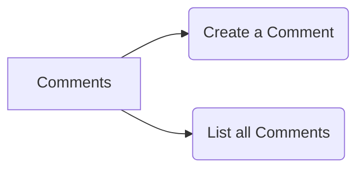

## Workflow for the comment service

The comment service has two functionality, `create comment` and `list of comments`

 

<!--MERMAID {width:100}-->

<!--MCONTENT {content: "graph LR \nA\\[Comments\\] \\-\\-\\> B(Create a Comment) \nA \\-\\-\\> C(List all Comments)"} --->

 

## **Goals**

1.  Create a comment associated with the given post ID

2.  Retrieve all comments associated with the given post ID

 

|### **Path**         |### **Method**|### Body         |
|---------------------|--------------|-----------------|
|`/posts/:id/comments`|POST          |{content: String}|
|`/posts/:id/comments`|GET           |\-               |

 

This file was generated by Swimm. [Click here to view it in the app](https://app.swimm.io/repos/Z2l0aHViJTNBJTNBYmxvZyUzQSUzQUF2aWF0b3JzY29kZTI=/docs/3fpjhed5).
