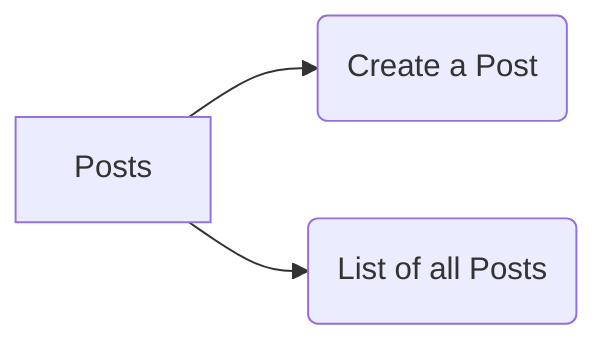

For the Posts service, two functionality was implemented.

1.  Create a Post

2.  List of all Posts

### Overall Architecture of the Posts Service

<br/>

<!--MERMAID {width:100}-->

<!--MCONTENT {content: "graph LR<br/>\nA\\[Posts\\] \\-\\-\\> B(Create a Post)<br/>\nA \\-\\-\\> C(List of all Posts)"} --->

<br/>

### High Level Diagram of the Post service

<br/>

|**Path**|**Method**|**Body?**       |**Goal**          |
|--------|----------|----------------|------------------|
|`/posts`|POST      |{ title: String}|Create a new Post |
|`/posts`|GET       |\-              |Retrieve all posts|

<br/>

This object will be used to store all the posts created
<!-- NOTE-swimm-snippet: the lines below link your snippet to Swimm -->
### 📄 posts/index.js
```javascript
12     const posts = {};
```

<br/>

### POST Request

<br/>

This method will accept a body which will be the title of the post.
<!-- NOTE-swimm-snippet: the lines below link your snippet to Swimm -->
### 📄 posts/index.js
```javascript
18     app.post('/posts/', (req, res) => {
19         const id = randomBytes(4).toString('hex');
20         const {title} = req.body;
21     
22         posts[id] = {
23             id, title
24         };
25     
26         res.status(201).send(posts[id]);
27     });
```

<br/>

**URL:** [http://localhost:4000/posts](http://localhost:4000/posts)

**Request body**

```
{
    "title": "third post"
}
```

### GET Method

<br/>

This method sends a response of all the posts to the client
<!-- NOTE-swimm-snippet: the lines below link your snippet to Swimm -->
### 📄 posts/index.js
```javascript
14     app.get('/posts', (req, res) => {
15         res.send(posts);
16     });
```

<br/>

**URL:** [http://localhost:4000/posts](http://localhost:4000/posts)

**Response**

```markdown
{
    "8012cd38": {
        "id": "8012cd38",
        "title": "Amazingly"
    }
    
}
```

<br/>

<br/>

This file was generated by Swimm. [Click here to view it in the app](https://app.swimm.io/repos/Z2l0aHViJTNBJTNBYmxvZyUzQSUzQUF2aWF0b3JzY29kZTI=/docs/y0ntx99f).
