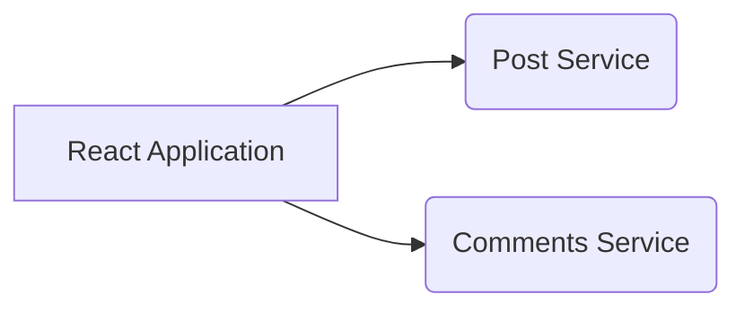
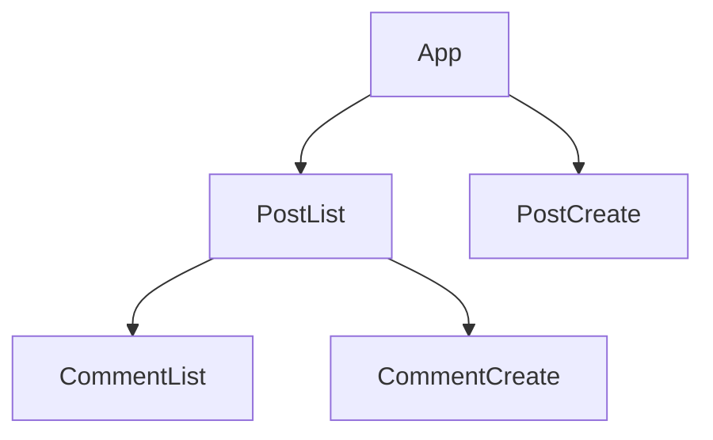

<!--MERMAID {width:100}-->

<!--MCONTENT {content: "graph LR \nA\\[React Application\\] \\-\\-\\> B(Post Service) \nA \\-\\-\\> C(Comments Service)"} --->

 

### General Component design of the application

 

<!--MERMAID {width:100}-->

<!--MCONTENT {content: "graph TD \nA\\[App\\] \nA \\-\\-\\> B\\[PostList\\] \nA \\-\\-\\> C\\[PostCreate\\] \nB \\-\\-\\> D\\[CommentList\\] \nB \\-\\-\\> E\\[CommentCreate\\] \n\n "} --->

 

`App` is the root component

`PostCreate`: this component will accept title and also have a submit button

`PostList`: This component will list all post and also include the `CommentCreate`component to create comment on each post and the `CommentList` component which will list out all the comment made on each post.

 

 

This file was generated by Swimm. [Click here to view it in the app](https://app.swimm.io/repos/Z2l0aHViJTNBJTNBYmxvZyUzQSUzQUF2aWF0b3JzY29kZTI=/docs/ttsl2nz4).
